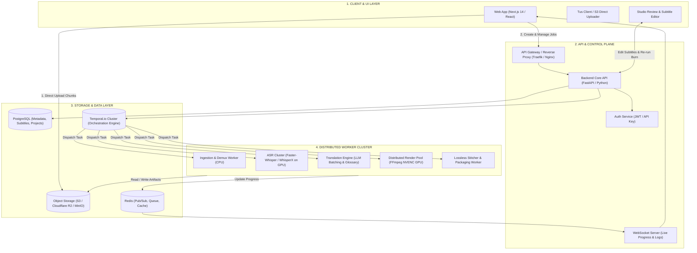
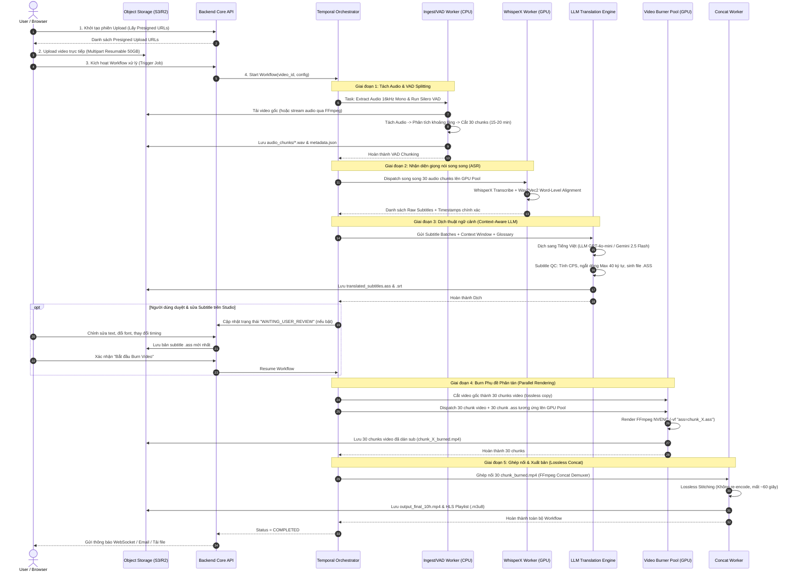
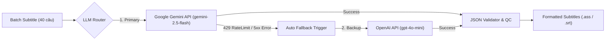

# KIẾN TRÚC HỆ THỐNG DỊCH TỰ ĐỘNG & DÁN PHỤ ĐỀ VIDEO THỜI LƯỢNG LỚN (LÊN TỚI 10 TIẾNG)
**Auto Video Translation & Subtitle Burner System Architecture (Large Scale - 10h+ Video)**

---

## 1. TỔNG QUAN HỆ THỐNG & CÁC THÁCH THỨC KỸ THUẬT

Hệ thống được thiết kế để xử lý tự động toàn bộ quy trình: **Tải lên video dài (lên tới 10 tiếng, dung lượng 5GB - 50GB+) $\rightarrow$ Tách Audio $\rightarrow$ Nhận diện giọng nói (ASR) $\rightarrow$ Dịch thuật ngữ cảnh bằng LLM $\rightarrow$ Kiểm soát định dạng phụ đề $\rightarrow$ Render/Burn phụ đề song song phân tán $\rightarrow$ Ghép nối và Xuất bản video hoàn chỉnh.**

### Các thách thức kỹ thuật cốt lõi và giải pháp
| Thách thức | Nguy cơ nếu chạy Monolith / Đơn luồng | Giải pháp Kiến trúc Phân tán |
| :--- | :--- | :--- |
| **Upload video 50GB** | Timeout kết nối, nghẽn băng thông server web, đứt mạng phải upload lại từ đầu | **Resumable Multipart Upload (Tus.io / S3 Direct)** đẩy trực tiếp từ trình duyệt lên Object Storage. |
| **ASR video 10 tiếng** | Tràn VRAM GPU (OOM), Whisper timeout, mất dấu ngữ cảnh | **Silero VAD Splitting:** Cắt âm thanh theo khoảng lặng thành các chunk 10-15 phút; xử lý song song trên pool GPU WhisperX. |
| **Dịch thuật phụ đề** | Dịch máy thô cứng, ngắt câu sai ngữ cảnh, mất tính nhất quán thuật ngữ | **Context-Aware LLM Translation:** Dịch theo sliding-window (cung cấp 5 câu trước/sau) kết hợp từ điển chuyên ngành (Glossary). |
| **Render/Burn phụ đề 10h** | Mất 4 - 8 tiếng encode; nếu crash ở phút thứ 590 sẽ mất trắng toàn bộ tiến trình | **Distributed Video Chunking:** Cắt video thành 30 chunks, burn phụ đề song song trên 10-15 GPU workers (NVENC), ghép nối Lossless trong 60s. |
| **Quản lý trạng thái & lỗi** | Khó debug, worker chết không thể tiếp tục | **Temporal.io Orchestrator:** State Machine tự động retry từng sub-task, checkpointing trạng thái liên tục. |

---

## 2. SƠ ĐỒ KIẾN TRÚC TỔNG THỂ (HIGH-LEVEL ARCHITECTURE)



---

## 3. LUỒNG XỬ LÝ END-TO-END (DETAILED 7-PHASE FLOW)



---

## 4. CHI TIẾT TỪNG PHÂN HỆ KỸ THUẬT

### 4.1. Phân hệ Ingestion & Audio VAD Chunking
* **Audio Demuxing:** Sử dụng FFmpeg stream trực tiếp mà không cần tải toàn bộ 50GB video về RAM:
  ```bash
  ffmpeg -i "s3_presigned_url" -vn -acodec pcm_s16le -ar 16000 -ac 1 -f wav pipe:1
  ```
* **VAD (Voice Activity Detection):** Dùng **Silero VAD** để tìm điểm ngắt câu tự nhiên (khoảng lặng > 500ms) quanh mốc 15 phút. Tránh việc cắt cụt giữa chừng từ ngữ.

### 4.2. Phân hệ ASR & Word-Level Alignment (WhisperX)
* Model: `faster-whisper-large-v3` hoặc `WhisperX` chạy với `float16` hoặc `int8_float16` trên GPU NVIDIA (RTX 4090 / T4 / A10G).
* **Word Alignment:** Sau khi nhận diện văn bản, sử dụng mô hình Wav2Vec2 đối soát âm vị để thu được `start_time` và `end_time` chính xác của từng từ đơn lẻ. Điều này giúp phụ đề khớp 100% với khẩu hình của diễn giả.

### 4.3. Phân hệ Dịch Thuật Ngữ Cảnh Đa Mô Hình (Multi-LLM: Google Gemini & OpenAI)
Hệ thống sử dụng cơ chế **Dual-Engine / Multi-Provider Router** cho phép linh hoạt lựa chọn hoặc tự động fallback giữa **Google Gemini** và **OpenAI**:

* **Google Gemini (Khuyên dùng chính - Primary):**
  * Models: `gemini-2.5-flash` (thế hệ mới nhất, tốc độ cực nhanh, dịch tiếng Việt thông minh vượt trội, context window 1M tokens), `gemini-2.0-flash`, `gemini-1.5-pro`.
  * Ưu điểm: Hiểu văn cảnh tiếng Việt rất tự nhiên, hỗ trợ sliding window ngữ cảnh cực lớn.
* **OpenAI (Dự phòng & Nâng cao - Fallback / High-Precision):**
  * Models: `gpt-4o-mini` (nhanh, chi phí tối ưu, định dạng JSON chuẩn xác), `gpt-4o` (chất lượng cao nhất cho video hội thảo, tài chính phức tạp), `o3-mini`.
  * Ưu điểm: Khả năng tuân thủ cấu trúc JSON và giới hạn ký tự (Max characters per line) cực kỳ nghiêm ngặt.

#### Cơ chế Tự Động Chuyển Đổi (Auto-Fallback & Circuit Breaker)


* **Prompt Architecture (Structured JSON Mode):**
  ```text
  SYSTEM: Bạn là chuyên gia dịch thuật phụ đề video chuyên nghiệp sang Tiếng Việt.
  QUY TẮC BẮT BUỘC:
  1. Trả về đúng định dạng JSON: {"subtitles": [{"id": 1, "text": "Nội dung dịch"}]}
  2. Văn phong tự nhiên, chuẩn văn hóa Tiếng Việt, không dịch thô word-by-word.
  3. Tuân thủ bảng thuật ngữ (Glossary) đính kèm.
  4. Độ dài mỗi câu dịch tối đa 40 ký tự trên mỗi dòng.
  
  GLOSSARY:
  {glossary_json}

  NGỮ CẢNH TRƯỚC ĐÓ (5 câu):
  {previous_context_lines}

  DANH SÁCH CÂU CẦN DỊCH:
  {batch_subtitles_json}
  ```

> 📖 **Xem tài liệu thiết kế chuyên sâu:** Tham khảo chi tiết toàn bộ bộ quy tắc xưng hô đa ngôn ngữ (Anh/Trung/Nhật/Hàn), Speaker Profiler, Smart Chunking và hệ thống 4 lớp Guardrails tại: [`Translation_Engine_Specification.md`](file:///d:/OneFl/Translation_Engine_Specification.md).

### 4.4. Phân hệ Subtitle QC & ASS Styler
* Chuyển đổi sang định dạng `.ass` (Advanced SubStation Alpha) với cấu hình hiển thị chuẩn điện ảnh:
  ```ini
  [V4+ Styles]
  Format: Name, Fontname, Fontsize, PrimaryColour, SecondaryColour, OutlineColour, BackColour, Bold, Italic, Underline, StrikeOut, ScaleX, ScaleY, Spacing, Angle, BorderStyle, Outline, Shadow, Alignment, MarginL, MarginR, MarginV, Encoding
  Style: Default,Roboto,22,&H00FFFFFF,&H000000FF,&H00000000,&H80000000,1,0,0,0,100,100,0,0,1,2,1,2,20,20,25,1
  ```
* **Luật CPS (Characters Per Second):** Tốc độ đọc khuyến nghị 15 - 18 CPS cho người Việt. Nếu vượt quá 22 CPS, hệ thống tự động tóm lược câu văn nhưng bảo toàn 100% ý nghĩa.

### 4.5. Phân hệ Distributed Video Subtitle Burner
1. **Cắt video gốc thành các đoạn (Segments):**
   ```bash
   ffmpeg -ss {start_time} -to {end_time} -i input.mp4 -c copy -avoid_negative_ts make_zero chunk_{i}.mp4
   ```
2. **Burn Subtitle song song bằng GPU NVENC:**
   ```bash
   ffmpeg -hwaccel cuda -i chunk_{i}.mp4 -vf "ass=chunk_{i}.ass" -c:v h264_nvenc -preset p4 -cq 22 -c:a aac -b:a 192k chunk_{i}_burned.mp4
   ```
3. **Ghép nối Lossless (Concat):**
   ```bash
   ffmpeg -f concat -safe 0 -i filelist.txt -c copy final_output.mp4
   ```

---

## 5. THIẾT KẾ CƠ SỞ DỮ LIỆU (POSTGRESQL SCHEMA)

```sql
-- 1. Bảng Dự án Video
CREATE TABLE projects (
    id UUID PRIMARY KEY DEFAULT gen_random_uuid(),
    user_id VARCHAR(64) NOT NULL,
    title VARCHAR(255) NOT NULL,
    original_video_url TEXT NOT NULL,
    video_duration_seconds DOUBLE PRECISION,
    source_language VARCHAR(10) DEFAULT 'auto',
    target_language VARCHAR(10) DEFAULT 'vi',
    status VARCHAR(50) DEFAULT 'CREATED', -- UPLOADING, PROCESSING, WAITING_REVIEW, BURNING, COMPLETED, FAILED
    progress_percentage INTEGER DEFAULT 0,
    created_at TIMESTAMP WITH TIME ZONE DEFAULT NOW(),
    updated_at TIMESTAMP WITH TIME ZONE DEFAULT NOW()
);

-- 2. Bảng Phân đoạn Video / Audio (Tasks)
CREATE TABLE video_chunks (
    id UUID PRIMARY KEY DEFAULT gen_random_uuid(),
    project_id UUID REFERENCES projects(id) ON DELETE CASCADE,
    chunk_index INTEGER NOT NULL,
    start_time DOUBLE PRECISION NOT NULL,
    end_time DOUBLE PRECISION NOT NULL,
    audio_chunk_url TEXT,
    video_chunk_url TEXT,
    burned_chunk_url TEXT,
    status VARCHAR(50) DEFAULT 'PENDING',
    retry_count INTEGER DEFAULT 0,
    created_at TIMESTAMP WITH TIME ZONE DEFAULT NOW()
);

-- 3. Bảng Dữ liệu Phụ đề (Subtitles)
CREATE TABLE subtitle_cues (
    id UUID PRIMARY KEY DEFAULT gen_random_uuid(),
    project_id UUID REFERENCES projects(id) ON DELETE CASCADE,
    cue_index INTEGER NOT NULL,
    start_time DOUBLE PRECISION NOT NULL,
    end_time DOUBLE PRECISION NOT NULL,
    original_text TEXT NOT NULL,
    translated_text TEXT,
    speaker_tag VARCHAR(50),
    is_edited BOOLEAN DEFAULT FALSE,
    updated_at TIMESTAMP WITH TIME ZONE DEFAULT NOW()
);

-- 4. Bảng Thuật ngữ Chuyên ngành (Glossary)
CREATE TABLE glossaries (
    id UUID PRIMARY KEY DEFAULT gen_random_uuid(),
    project_id UUID REFERENCES projects(id) ON DELETE CASCADE,
    source_term VARCHAR(255) NOT NULL,
    target_term VARCHAR(255) NOT NULL,
    context_note TEXT
);
```

---

## 6. KHẢ NĂNG CHỊU LỖI & CHECKPOINTING (TEMPORAL.IO WORKFLOW)

* **Idempotency:** Mỗi chunk mang một ID cố định dạng `{project_id}_{chunk_index}`. Nếu worker bị restart, nó sẽ kiểm tra trên S3 xem chunk đã được render chưa trước khi tính toán lại.
* **Auto Retry Policy:**
  * Network / S3 API: Retry tối đa 5 lần với exponential backoff.
  * GPU Worker Crash: Temporal tự động chuyển Task sang GPU Worker khác trong Pool.
* **Heartbeat Mechanism:** Mỗi GPU Worker gửi Heartbeat định kỳ 10 giây/lần. Nếu quá 30 giây không nhận được tín hiệu, Task được đánh dấu là TIMEOUT và gán lại cho worker khác.

---

## 7. DỰ TOÁN HIỆU NĂNG & CHI PHÍ CHO 1 VIDEO 10 TIẾNG

| Bước thực hiện | Thời gian thực thi (Đơn luồng) | Thời gian thực thi (Hệ thống phân tán) | Tài nguyên sử dụng |
| :--- | :--- | :--- | :--- |
| **Audio Extraction & VAD** | 10 phút | **2 phút** | 1x CPU Worker |
| **WhisperX ASR** | 90 phút | **10 phút** (Chia 10 chunks trên GPU Pool) | 2x GPU RTX 4090 / A10G |
| **LLM Translation** | 30 phút | **3 phút** (Batching song song) | LLM API (Gemini Flash/GPT-4o-mini) |
| **Render/Burn Subtitle** | 240 phút (4h) | **15 phút** (Chia 20 chunks song song) | 4x GPU Worker (NVENC) |
| **Concat & Packaging** | 10 phút | **1 phút** (Lossless Demux) | 1x CPU Worker |
| **TỔNG THỜI GIAN** | **~6.5 tiếng** | **~30 - 35 phút** | Giảm hơn **90%** thời gian chờ đợi |
