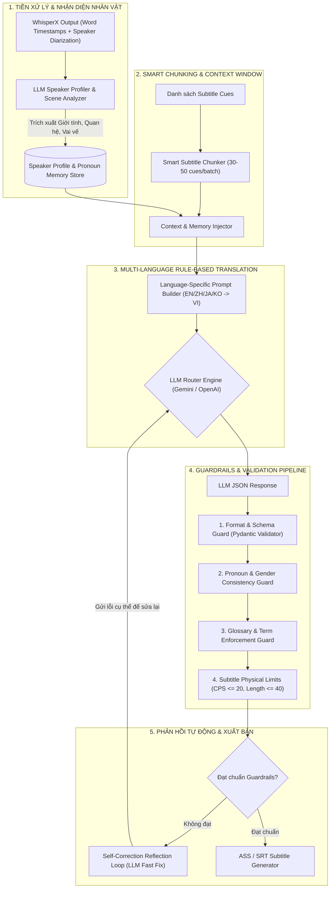

# THIẾT KẾ CHI TIẾT HỆ THỐNG DỊCH THUẬT AI CHUYÊN SÂU (AI TRANSLATION ENGINE & GUARDRAILS)
**Đa Ngôn Ngữ: Tiếng Anh, Trung, Nhật, Hàn $\rightarrow$ Tiếng Việt**
**Xử lý Ngữ cảnh, Giới tính, Đại từ xưng hô, Chunking & Guardrails**

---

## 1. TỔNG QUAN VẤN ĐỀ & GIẢI PHÁP KIẾN TRÚC

Dịch phụ đề video dài (đặc biệt từ **Anh, Trung, Nhật, Hàn** sang **Tiếng Việt**) là bài toán rất phức tạp về mặt ngữ nghĩa và văn hóa:
1. **Đại từ xưng hô & Giới tính:** 
   * *Tiếng Anh:* Chỉ có "I / You / He / She", dịch sang tiếng Việt phải là "Anh - Em", "Tôi - Bạn", "Bố - Con", "Sếp - Em", "Chú - Cháu"...
   * *Tiếng Trung:* Xưng hô theo vai vế, quan hệ xã hội (Anh/Em, Huynh/Đệ, Sếp/Nhân viên, Bạn bè), thành ngữ 4 chữ (Thành ngữ Hán - Việt).
   * *Tiếng Nhật:* Hệ thống kính ngữ (Keigo, Teineigo, Kenjougo), hậu tố danh xưng (*-san, -kun, -chan, -senpai, -sensei*), đại từ tự xưng (*Watashi, Boku, Ore, Atashi*).
   * *Tiếng Hàn:* Kính ngữ (Kính ngữ 존댓말 vs Nói trống không 반말), đại từ thân mật (*Oppa, Hyung, Noona, Unnie, Sunbae, Daepyo-nim*).
2. **Tính nhất quán xuyên suốt 10 tiếng:** Nhân vật không thể ở phút thứ 10 xưng "Anh - Em", đến phút 200 lại đổi thành "Tôi - Cô", rồi phút 400 lại thành "Mày - Tao".
3. **Giới hạn hiển thị phụ đề:** Phụ đề không được dài quá 40 ký tự/dòng, không quá 2 dòng, tốc độ đọc không quá 20 CPS (Characters Per Second).

---

## 2. SƠ ĐỒ TOÀN DIỆN ENGINE DỊCH THUẬT & GUARDRAILS



---

## 3. CHI TIẾT CÁC CÔNG CỤ & QUY TẮC (RULE-BASE & TOOLS)

### 3.1. Tool 1: Speaker Diarization & Character Profiler (Nhận diện nhân vật)
Trước khi dịch toàn bộ video, hệ thống chạy 1 tác vụ quét nhanh (Pre-pass) để lập **Bảng Nhân Vật (Speaker Profile)**:

```json
{
  "project_id": "proj_123456",
  "speakers": {
    "SPEAKER_00": {
      "name": "Alex",
      "gender": "male",
      "age_group": "adult (35-40)",
      "role": "Giám đốc / Trưởng nhóm",
      "tone": "Lịch sự, quyết đoán, chuyên nghiệp"
    },
    "SPEAKER_01": {
      "name": "Linh",
      "gender": "female",
      "age_group": "young_adult (24-27)",
      "role": "Nhân viên cấp dưới",
      "tone": "Lễ phép, năng động"
    }
  },
  "relationship_matrix": {
    "SPEAKER_00_to_SPEAKER_01": {
      "self": "Anh / Tôi",
      "target": "Em / Linh",
      "relationship": "Sếp - Nhân viên"
    },
    "SPEAKER_01_to_SPEAKER_00": {
      "self": "Em",
      "target": "Sếp / Anh Alex",
      "relationship": "Nhân viên - Sếp"
    }
  }
}
```

---

### 3.2. Tool 2: Language-Specific Translation Rules (Quy tắc cho từng ngôn ngữ)

#### A. Tiếng Anh (English $\rightarrow$ Vietnamese)
* **Quy tắc Đại từ:** Khử đại từ trung tính (I/You/We/They). Căn cứ theo `relationship_matrix` để gán đại từ chính xác.
* **Quy tắc Phrasal Verbs & Idioms:** Dịch thoát ý, không dịch từng từ (VD: *"Break a leg"* $\rightarrow$ *"Chúc may mắn"*, không dịch *"Gãy chân"*).
* **Quy tắc Chuyên ngành Công nghệ/Tài chính:** Giữ nguyên các từ chuẩn quốc tế (VD: *API, Backend, Database, Scalability, ROI*).

#### B. Tiếng Trung (Chinese $\rightarrow$ Vietnamese)
* **Quy tắc Hán Việt vs Thuần Việt:** 
  * Video hiện đại/đời sống: Ưu tiên từ **Thuần Việt** tự nhiên (VD: 吃饭 $\rightarrow$ *Ăn cơm*, 方便 $\rightarrow$ *Tiện lợi / Thuận tiện*).
  * Video cổ trang, kiếm hiệp, lịch sử: Sử dụng âm **Hán Việt** trang trọng (VD: 殿下 $\rightarrow$ *Điện hạ*, 师傅 $\rightarrow$ *Sư phụ*).
* **Quy tắc Xưng hô:** 
  * 哥 (Anh), 姐 (Chị), 妹 (Em gái), 弟 (Em trai).
  * 您 (Ngài/Bác/Anh - thể lịch sự) $\rightarrow$ Dịch trang trọng theo tuổi tác nhân vật.
* **Xử lý Thành ngữ 4 chữ (成语):** Chuyển sang thành ngữ tiếng Việt tương đương (VD: 一石二鸟 $\rightarrow$ *Một mũi tên trúng hai đích*).

#### C. Tiếng Nhật (Japanese $\rightarrow$ Vietnamese)
* **Hệ thống Kính ngữ (敬語 - Keigo):**
  * **Sonkeigo (Tôn kính ngữ) / Kenjougo (Khiêm nhường ngữ):** Dịch kèm sắc thái trang trọng, thêm kính ngữ "Dạ / Thưa / Kính gửi" hoặc xưng hô chuẩn mực.
  * **Tameguchi (Nói thân mật):** Dịch giọng điệu gần gũi, thoải mái giữa bạn bè.
* **Hậu tố Danh xưng:**
  * `-san` $\rightarrow$ Anh / Chị / Bạn [Tên].
  * `-sensei` $\rightarrow$ Thầy / Cô / Bác sĩ [Tên].
  * `-senpai` $\rightarrow$ Tiền bối / Anh / Chị [Tên].
  * `-chan / -kun` $\rightarrow$ Bé / Em / Cậu [Tên].
* **Đại từ Tự xưng:**
  * *Watashi / Watakushi:* Tôi / Em.
  * *Boku / Ore:* Tôi / Tao / Anh / Mình (tùy độ thân thiết).
  * *Anata / Omae / Kimi:* Bạn / Cậu / Mày / Em.

#### D. Tiếng Hàn (Korean $\rightarrow$ Vietnamese)
* **Kính ngữ (존댓말 - Jondaetmal) vs Thân mật (반말 - Banmal):**
  * Đuôi câu `-습니다/-십니까 / -해요` $\rightarrow$ Thể hiện sự tôn trọng ("ạ", "thưa anh", "vâng").
  * Đuôi câu `-야/-어/-지` $\rightarrow$ Xưng hô thân mật giữa bạn bè, người lớn nói với trẻ nhỏ.
* **Danh xưng Xã hội & Gia đình:**
  * `Oppa (오빠)` $\rightarrow$ Anh (khi nữ gọi nam lớn tuổi thân thiết/người yêu).
  * `Hyung (형)` $\rightarrow$ Anh (nam gọi nam lớn tuổi hơn).
  * `Noona (누나)` $\rightarrow$ Chị (nam gọi nữ lớn tuổi hơn).
  * `Unnie (언니)` $\rightarrow$ Chị (nữ gọi nữ lớn tuổi hơn).
  * `Sunbae (선배)` $\rightarrow$ Tiền bối.
  * `Daepyo-nim (대표님)` $\rightarrow$ Giám đốc / Sếp.

---

### 3.3. Tool 3: Smart Chunking & Context Window Engine

```python
# Cấu trúc 1 Chunk gửi vào LLM
class TranslationChunkPayload:
    source_language: str        # en | zh | ja | ko
    target_language: str        # vi
    scene_context: str          # Bối cảnh (Hội nghị, Quán cà phê, Phim hành động...)
    speaker_profiles: dict      # Danh sách nhân vật & vai vế
    glossary: dict              # Bảng thuật ngữ chuyên ngành
    previous_context: list      # 5 câu đã dịch liền trước (để giữ mạch câu)
    current_batch: list         # 30-50 câu phụ đề cần dịch
    next_preview: list          # 3 câu tiếp theo (để nhìn trước hướng hội thoại)
```

---

### 3.4. Tool 4: Comprehensive Guardrails & Reflection Loop (Hệ thống Kiểm soát Chất lượng)

Hệ thống chạy 4 lớp kiểm duyệt (Guardrails Pipeline) trước khi chấp nhận kết quả dịch:

| Lớp Guardrail | Mục tiêu kiểm tra | Hành động khi vi phạm |
| :--- | :--- | :--- |
| **1. Structural Guard** | Định dạng JSON hợp lệ, số lượng câu trả về khớp 100% với số lượng câu đầu vào, ID không bị nhảy. | Tự động parse sửa lỗi JSON hoặc gửi yêu cầu sinh lại. |
| **2. Pronoun Consistency Guard** | Kiểm tra xem `SPEAKER_01` có xưng hô đúng với `relationship_matrix` đã định nghĩa không. | Cảnh báo vi phạm đại từ, kích hoạt Fast Reflexion Loop để sửa đại từ. |
| **3. Glossary Enforcement Guard** | Thuật ngữ trong từ điển bắt buộc phải xuất hiện chính xác ở kết quả dịch. | Regex Check: Nếu thiếu, ép LLM thay thế từ khóa đúng theo bảng Glossary. |
| **4. Physical Subtitle Limits** | - Độ dài $\le 40$ ký tự/dòng.<br>- Số dòng $\le 2$ dòng.<br>- Tốc độ đọc $\le 20$ CPS. | Thuật toán Auto-Wrap ngắt dòng thông minh; nếu CPS > 20, LLM tóm lược câu nhưng giữ nguyên nghĩa. |

#### Quy trình Self-Correction Reflexion Loop (Tự Động Sửa Lỗi)
Nếu phát hiện lỗi (ví dụ: dòng 12 quá dài hoặc xưng hô sai), hệ thống **không dịch lại toàn bộ batch** mà chỉ gửi prompt phản xạ (Reflexion Prompt) cực ngắn:
```text
SYSTEM: Bạn là Guardrail Fixer.
Đoạn dịch sau vi phạm quy tắc:
- Câu #12: Độ dài 58 ký tự (Quá giới hạn 40 ký tự) và Tốc độ đọc 24 CPS (Vượt mức 20).
- Câu #15: SPEAKER_01 xưng "Tôi" với SPEAKER_00, trong khi quan hệ là "Em - Anh".

Hãy viết lại DUY NHẤT 2 câu #12 và #15 để thỏa mãn toàn bộ quy tắc trên.
```

---

## 4. TEMPLATE PROMPT CHUẨN SẢN XUẤT CHO LLM TRANSLATOR

```text
[SYSTEM PROMPT]
Bạn là một AI Dịch Thuật Phụ Đề Video Chuyên Nghiệp Đỉnh Cao sang Tiếng Việt.
Nhiệm vụ của bạn là dịch danh sách các câu thoại phụ đề từ {SOURCE_LANG} sang {TARGET_LANG}.

### BẢNG HỒ SƠ NHÂN VẬT & QUY TẮC XƯNG HÔ (BẮT BUỘC TUÂN THỦ):
{SPEAKER_PROFILES_JSON}

### BẢNG THUẬT NGỮ CHUYÊN NGÀNH (GLOSSARY):
{GLOSSARY_JSON}

### NGUYÊN TẮC DỊCH THUẬT BẤT DI BẤT DỊCH:
1. XƯNG HÔ: Căn cứ vào ID người nói (speaker_id) và người nghe để xưng hô chuẩn xác 100% theo bảng hồ sơ. Không tự ý đổi đại từ xưng hô giữa chừng.
2. VĂN PHONG: Tự nhiên, thuần Việt, đúng phong cách đời thực, không dịch thô word-by-word.
3. GIỚI HẠN VẬT LÝ PHỤ ĐỀ:
   - Tối đa 38 - 40 ký tự trên một dòng. Nếu dài, hãy ngắt dòng bằng dấu "\n" tại vị trí có nghĩa tự nhiên.
   - Tối đa 2 dòng cho một câu phụ đề.
   - Giữ câu văn súc tích, tránh từ đệm rườm rà để người xem kịp đọc.
4. ĐỊNH DẠNG ĐẦU RA: Bắt buộc trả về đúng định dạng JSON có cấu trúc sau:
{
  "translations": [
    {
      "id": 1,
      "text": "Câu dịch tiếng Việt đã format hợp lý"
    }
  ]
}

[CONTEXT TRƯỚC ĐÓ]:
{PREVIOUS_5_SUBTITLES}

[DANH SÁCH PHỤ ĐỀ CẦN DỊCH]:
{CURRENT_BATCH_SUBTITLES_JSON}
```

---

## 5. THƯ VIỆN & CÔNG CỤ ĐỀ XUẤT CHO BỘ ENGINE NÀY

| Thành phần | Thư viện / Framework đề xuất | Vai trò |
| :--- | :--- | :--- |
| **Speaker Diarization** | `pyannote.audio` + `WhisperX` | Phân đoạn người nói và timestamp chuẩn xác |
| **Guardrails & Schema Validation** | `pydantic` v2 + `instructor` | Ép cấu trúc JSON, xác thực kiểu dữ liệu và kiểm tra logic |
| **Text Wrapping & CPS Engine** | `pysubs2` + Custom Rule Engine | Tính toán thời gian hiển thị, ngắt dòng phụ đề chuẩn `.ass` |
| **Pronoun Memory & Glossary Store**| PostgreSQL JSONB / Redis | Lưu trữ hồ sơ nhân vật và thuật ngữ xuyên suốt 10 tiếng video |
| **LLM Inference** | `google-generativeai` & `openai` SDKs | Gọi Gemini 2.5 Flash (Primary) và GPT-4o-mini (Fallback) |

---

## 6. CẨM NANG DỊCH THUẬT TIẾNG VIỆT CHUYÊN SÂU DỰA TRÊN NGỮ CẢNH VIDEO (VIDEO-GROUNDED TRANSLATION HANDBOOK)

Một bản dịch phụ đề điện ảnh xuất sắc không đơn thuần là chuyển đổi ngôn ngữ văn bản (Text-to-Text), mà là **nghệ thuật hòa quyện đa phương thức (Multimodal Fusion)** giữa **Hình ảnh (Visual) - Âm thanh (Audio) - Câu chữ phụ đề (Subtitle)**. 

### 6.1. Bốn Nguyên Lý Dịch Thuật Thị Giác (The 4 Visual Translation Axioms)

#### 1. Khớp Cảm Xúc & Khẩu Khí Nhân Vật (Facial & Emotional Grounding)
Tiếng Việt là ngôn ngữ giàu trợ từ cảm thán và sắc thái biểu cảm. Dựa vào hình ảnh trên màn hình để thêm các hư từ phù hợp:
* **Nhân vật cười nhếch mép, châm chọc, khoanh tay:** Thêm các trợ từ mang sắc thái thách thức hoặc trêu chọc (*"cơ đấy", "cơ à", "đấy nhé", "chứ ai", "hả"*).
  * *Ví dụ (EN):* "You think you can beat me?" $\rightarrow$ *"Mày nghĩ mày thắng nổi tao cơ à?"* (thay vì dịch máy khô khan: *"Bạn nghĩ bạn có thể đánh bại tôi?"*).
* **Nhân vật nghẹn ngào, mắt ngấn lệ, nhìn xa xăm:** Dịch mềm mại, nhịp câu chậm, giàu cảm xúc (*"anh xin lỗi", "đừng khóc nữa mà em"*).
* **Nhân vật gầm thét, nhe răng, cầm vũ khí lao tới:** Dùng câu ngắn gọn, dứt khoát, âm điệu bộc trực (*"Chết tiệt!", "Cút ngay!", "Tao sẽ nghiền nát mày!"*).
* **Nhân vật cúi đầu 90 độ, hai tay cung kính:** Thêm kính ngữ chuẩn mực (*"Dạ, thưa sếp", "Xin giám đốc yên tâm ạ"*).

#### 2. Định Vị Khoảng Cách Không Gian & Vị Thế Xã Hội (Proxemics & Hierarchy)
* **Cảnh cận cảnh (Close-up) / Ôm nhau / Đứng sát nhau:** Chuyển ngay sang đại từ thân mật (*"anh - em", "mình - cậu"*), tuyệt đối không dùng đại từ xa cách (*"tôi - bạn", "anh ta - cô ta"*).
* **Cảnh phòng họp / Đứng trước bàn giám đốc:** Duy trì nghiêm ngặt tôn ti công sở (*"sếp - em", "giám đốc - tôi", "trưởng phòng - em"*).
* **Cảnh chiến trường / Rút vũ khí đối đầu:** Dùng cặp xưng hô thù địch (*"ngươi - ta", "mày - tao", "bọn chúng - bọn tao"*).

#### 3. Khử Từ Đa Nghĩa Nhờ Vật Thể & Hành Động Trên Màn Hình (Multimodal Disambiguation)
Nhiều từ vựng trong tiếng Anh, Trung, Nhật, Hàn có nghĩa đa dạng tùy theo hành động:
* **"Fire!" (EN):** Nếu thấy nhân vật cầm súng/pháo đài $\rightarrow$ Dịch *"Bắn!"* hoặc *"Khai hỏa!"*; nếu thấy đám cháy bùng lên $\rightarrow$ Dịch *"Cháy rồi!"*.
* **"Bank" (EN):** Nếu thấy cảnh bờ cỏ, nước chảy $\rightarrow$ Dịch *"bờ sông/bờ suối"*; nếu thấy tòa nhà tài chính/ATM $\rightarrow$ Dịch *"ngân hàng"*.
* **"打" (ZH - Dǎ):** Nếu nhân vật cầm gậy $\rightarrow$ *"Đánh!"*; nếu cầm điện thoại $\rightarrow$ *"Gọi điện"*; nếu đứng trước quầy vé $\rightarrow$ *"Mua vé"*; nếu ngồi trước bàn phím $\rightarrow$ *"Gõ máy"*.
* **"他" vs "她" (ZH - Tā):** Khẩu ngữ tiếng Trung đều phát âm là "tā", ASR thường nhận nhầm thành chữ "他" (nam). Bắt buộc nhìn hình ảnh nhân vật nữ để dịch thành *"cô ấy, em ấy, nàng"*, cấm dịch *"anh ấy, hắn"*.

#### 4. Điều Chỉnh Tốc Độ Đọc Theo Nhịp Cắt Dựng (Pacing & CPS Alignment)
* **Cảnh hành động dồn dập (Fast cut, nhiều góc máy):** Khán giả mắt phải bận theo dõi chuyển động, phụ đề bắt buộc phải tinh gọn, dịch thoát ý, độ dài $\le 30$ ký tự, tốc độ đọc $\le 16$ CPS để không làm người xem mỏi mắt.
* **Cảnh tự sự, độc thoại chậm rãi (Long take):** Dịch trọn vẹn ý tứ, sử dụng ngôn từ trau chuốt, giàu hình ảnh.

---

### 6.2. Từ Điển Thuật Ngữ Chuẩn Mực (Master Glossary Reference)
Toàn bộ 1000+ thuật ngữ chuẩn mực được lưu trữ tại [`backend/app/resources/glossary_master.json`](file:///D:/OneFL/backend/app/resources/glossary_master.json) với 4 ngôn ngữ nguồn chính:
* **Tiếng Anh (EN $\rightarrow$ VI):** Thuật ngữ phần mềm, kinh tế tài chính, thành ngữ điện ảnh, từ lóng pháp luật/điều tra.
* **Tiếng Trung (ZH $\rightarrow$ VI):** Cơ giáp khoa học viễn tưởng, tiên hiệp/kiếm hiệp cổ trang, từ lóng giới trẻ đô thị, khử lỗi ASR đồng âm.
* **Tiếng Nhật (JA $\rightarrow$ VI):** Kính ngữ Keigo công sở, danh xưng nhân vật, hoạt hình hành động Anime, thán từ đời thường.
* **Tiếng Hàn (KO $\rightarrow$ VI):** Kính ngữ Jondaetmal vs Banmal, tôn ti gia tộc & công sở, từ lóng K-Drama (Chaebol, Gapjil, Cider, Goguma).

